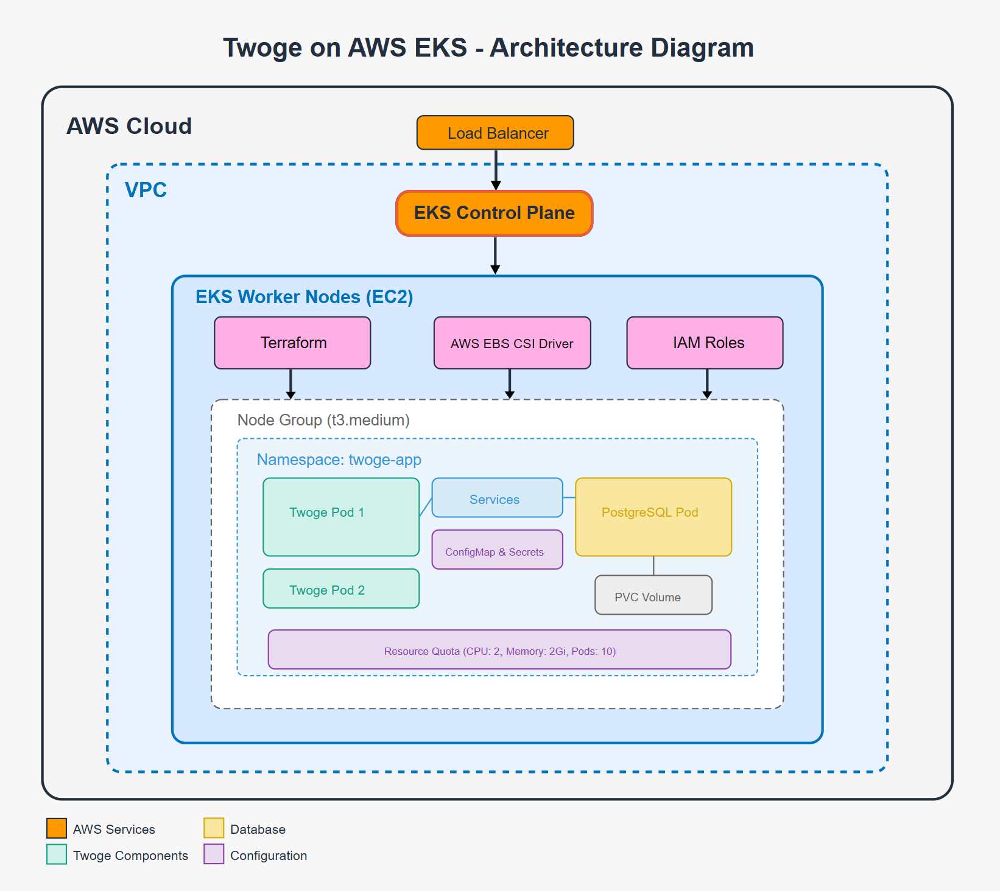

# Twoge Application on AWS EKS with Terraform

This README provides a comprehensive guide for deploying the Twoge application on Amazon EKS (Elastic Kubernetes Service) using Terraform for infrastructure management.

## Architecture Overview



The architecture includes:
- **AWS Load Balancer**: Provides external access to the application
- **EKS Control Plane**: Managed Kubernetes control plane
- **EKS Worker Nodes**: EC2 instances running the application workloads
- **Namespace (`twoge-app`)**: Isolates all application resources
- **Twoge Pods**: Flask application with Gunicorn WSGI server
- **PostgreSQL Pod**: Database with persistent storage
- **EBS Volume**: Provides persistent storage for PostgreSQL
- **Configuration**: ConfigMaps and Secrets for application settings

## Prerequisites

- AWS CLI installed and configured with appropriate permissions
- Terraform CLI installed (version >= 1.0.0)
- kubectl installed
- Docker installed (for building images)
- Access to Docker Hub or other container registry

## Project Structure

```
.
├── .github
│   └── workflows
│       ├── deploy.yml            # CI/CD workflow for deployment
│       └── destroy.yml           # CI/CD workflow for cleanup
├── terraform
│   ├── main.tf                   # Main Terraform configuration
│   └── variables.tf              # Variable definitions
├── k8s                           # Kubernetes YAML files (for reference)
├── Dockerfile                    # Application Docker image definition
├── app.py                        # Flask application
└── README.md                     # This file
```

## Infrastructure as Code with Terraform

This project uses Terraform to manage the Kubernetes resources within an existing EKS cluster. Terraform provides:

1. **Declarative Infrastructure**: All resources are defined as code
2. **State Management**: Terraform tracks all created resources
3. **Dependency Handling**: Resources are created in the correct order
4. **Idempotent Operations**: Same configuration always produces the same result
5. **Comprehensive Lifecycle Management**: Create, update, and destroy operations

## Deployment Process

### 1. Setting Up Infrastructure with Terraform

The `main.tf` file defines all Kubernetes resources needed for the application:

- Namespace for resource isolation
- ConfigMap for non-sensitive configuration
- Secret for sensitive configuration
- StorageClass for EBS volume provisioning
- PersistentVolumeClaim for PostgreSQL data
- Resource Quota for namespace limits
- PostgreSQL Deployment with proper probes
- Twoge Application Deployment with proper probes
- Services for network access

### 2. CI/CD Pipeline with GitHub Actions

The deployment uses GitHub Actions for CI/CD:

1. **Build and Push Docker Image**:
   - Builds the application image with Gunicorn
   - Tags with commit SHA for versioning
   - Pushes to Docker Hub

2. **Deploy Infrastructure with Terraform**:
   - Initializes Terraform
   - Plans changes
   - Applies the configuration

### 3. Accessing the Application

After deployment, the application is accessible via the Load Balancer:

```bash
# Get the Load Balancer URL
aws eks update-kubeconfig --name twoge-mikhail-cluster2 --region us-east-1
kubectl get svc twoge-service -n twoge-app
```

Access the application at: `http://<LOAD_BALANCER_DNS>:8080`

## Key Improvements

This deployment addresses common best practices:

1. **WSGI Server**: Uses Gunicorn instead of Flask's development server
2. **Environment Variables**: Properly configured through ConfigMaps and Secrets
3. **Image Tagging**: Uses commit SHA for precise versioning
4. **Health Probes**: Includes liveness and readiness probes
5. **Resource Quotas**: Prevents resource contention
6. **Persistent Storage**: Uses EBS volumes with StorageClass
7. **Namespaces**: Properly isolates application resources

## Managing the Deployment

### Apply Changes

Changes to the infrastructure are applied through the CI/CD pipeline or manually:

```bash
cd terraform
terraform init
terraform plan -var="image_tag=<TAG>" -var="docker_username=<USERNAME>"
terraform apply -var="image_tag=<TAG>" -var="docker_username=<USERNAME>"
```

### Destroy Resources

To tear down the infrastructure:

```bash
cd terraform
terraform destroy
```

Or trigger the `destroy.yml` workflow in GitHub Actions.

## Troubleshooting

### Common Issues

1. **PVC Not Binding**:
   - Ensure EBS CSI driver is installed
   - Check that the StorageClass is correct
   - Verify AWS permissions

2. **Database Connection Issues**:
   - Check Kubernetes Services
   - Verify environment variables
   - Check PostgreSQL logs: `kubectl logs -n twoge-app <postgres-pod-name>`

3. **Application Not Starting**:
   - Check application logs: `kubectl logs -n twoge-app <twoge-pod-name>`
   - Verify all environment variables are set correctly

## Security Considerations

- The example uses base64-encoded secrets for simplicity
- For production, consider using AWS Secrets Manager or AWS Parameter Store
- Implement network policies for additional security
- Use IAM roles for service accounts when possible

## Cost Optimization

- Use EC2 Spot Instances for non-critical workloads
- Implement Cluster Autoscaler for dynamic scaling
- Delete resources when not in use
- Consider smaller instance types for development

---

This deployment provides a solid foundation for running the Twoge application on AWS EKS following DevOps best practices with Infrastructure as Code using Terraform.