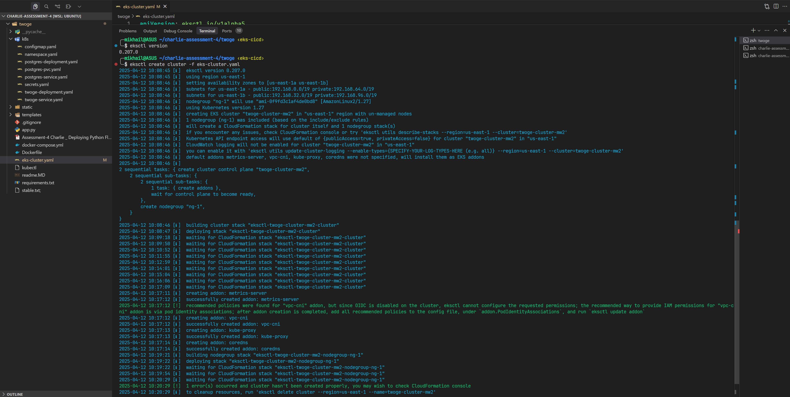
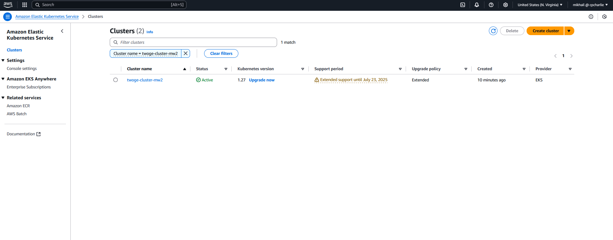
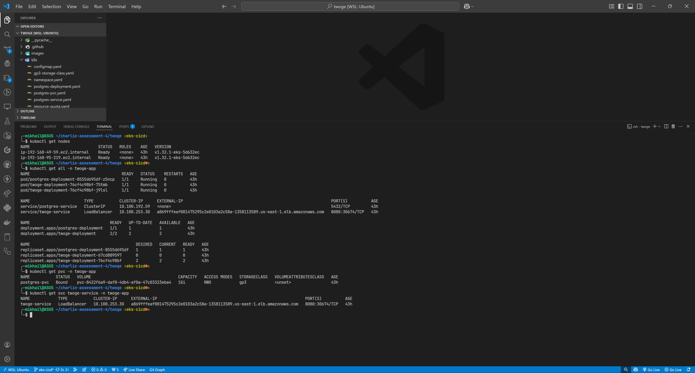

# Twoge Application on AWS EKS with Terraform and CI/CD

This README provides a comprehensive guide for deploying the Twoge application
on Amazon EKS (Elastic Kubernetes Service) using Terraform for infrastructure
management and GitHub Actions for CI/CD automation.

## Architecture Overview


The architecture includes:

- **AWS Load Balancer**: Provides external access to the application
- **EKS Control Plane**: Managed Kubernetes control plane
- **EKS Worker Nodes**: EC2 instances running the application workloads
- **Namespace (`twoge-app`)**: Isolates all application resources
- **Twoge Pods**: Flask application with Gunicorn WSGI server
- **PostgreSQL Pod**: Database with persistent storage
- **EBS Volume**: Provides persistent storage for PostgreSQL
- **Configuration**: ConfigMaps and Secrets for application settings

## Prerequisites

- AWS CLI installed and configured with appropriate permissions
- Terraform CLI installed (version >= 1.0.0)
- kubectl installed
- Docker installed (for building images)
- Docker Hub account (or another container registry)
- GitHub account for CI/CD workflow

## Project Structure

```
.
├── .github
│   └── workflows
│       ├── deploy.yml            # CI/CD workflow for deployment
│       └── destroy.yml           # CI/CD workflow for cleanup
├── terraform
│   ├── main.tf                   # Main Terraform configuration
│   └── variables.tf              # Variable definitions
├── k8s                           # Kubernetes YAML files (for reference)
│   ├── eks-cluster.yaml          # EKS cluster configuration with OIDC
│   ├── minimal-nodegroup.yaml    # Minimal nodegroup for initial setup
│   └── other manifests...
├── Dockerfile                    # Application Docker image definition
├── app.py                        # Flask application
└── README.md                     # This file
```

## Critical Deployment Sequence

A key aspect of this deployment is the correct sequencing of steps:

1. Create EKS cluster with OIDC enabled
2. Create a minimal nodegroup first
3. Set up the EBS CSI driver
4. Create main nodegroups (if needed)
5. Deploy the application using Terraform

This sequence is critical because the EBS CSI driver needs nodes to run on, but
nodes also need the EBS CSI driver for persistent storage.

## Deployment Process

### 1. Creating the EKS Cluster

First, create an EKS cluster with OIDC enabled using `eksctl`:

```bash
# Create just the EKS control plane (without nodegroups)
eksctl create cluster -f eks-cluster.yaml --without-nodegroup

# Update kubeconfig to interact with the new cluster
aws eks update-kubeconfig --name twoge-cluster-mw --region us-east-1
```

The `eks-cluster.yaml` must include OIDC configuration:

```yaml
apiVersion: eksctl.io/v1alpha5
kind: ClusterConfig
metadata:
  name: twoge-cluster-mw
  region: us-east-1
  version: '1.32'
iam:
  withOIDC: true
```

### 2. Creating a Minimal Nodegroup

Before setting up the EBS CSI driver, create a minimal nodegroup:

```bash
# Create the minimal nodegroup
eksctl create nodegroup -f minimal-nodegroup.yaml
```

### 3. Setting Up the EBS CSI Driver

After the minimal nodegroup is running, set up the Amazon EBS CSI driver:

```bash
# Create IAM service account for the EBS CSI driver
eksctl create iamserviceaccount \
  --name ebs-csi-controller-sa \
  --namespace kube-system \
  --cluster twoge-cluster-mw \
  --attach-policy-arn arn:aws:iam::aws:policy/service-role/AmazonEBSCSIDriverPolicy \
  --approve

# Install the EBS CSI driver add-on
eksctl create addon --name aws-ebs-csi-driver \
  --cluster twoge-cluster-mw \
  --service-account-role-arn <ROLE_ARN> \
  --force
```

### 4. Infrastructure as Code with Terraform

The Terraform configuration (`main.tf`) defines all Kubernetes resources needed
for the application:

- Namespace for resource isolation
- ConfigMap for non-sensitive configuration
- Secret for sensitive configuration
- StorageClass for EBS volume provisioning
- PersistentVolumeClaim for PostgreSQL data
- Resource Quota for namespace limits
- PostgreSQL Deployment with proper probes
- Twoge Application Deployment with proper probes
- Services for network access

### 5. CI/CD with GitHub Actions

The deployment uses GitHub Actions for CI/CD pipeline:

#### Deployment Workflow (deploy.yml)

1. **Build and Push Docker Image**:

   - Builds the application image
   - Tags with commit SHA for versioning
   - Pushes to Docker Hub

2. **Deploy Infrastructure with Terraform**:
   - Initializes Terraform
   - Plans changes
   - Applies the configuration

```yaml
name: Deploy to EKS

jobs:
  build-and-deploy:
    runs-on: ubuntu-latest

    steps:
      - uses: actions/checkout@v2

      - name: Configure AWS credentials
        uses: aws-actions/configure-aws-credentials@v1

      - name: Login to Docker Hub
        uses: docker/login-action@v1

      - name: Build and push Docker image
        uses: docker/build-push-action@v2

      - name: Setup Terraform
        uses: hashicorp/setup-terraform@v1

      - name: Terraform Init, Plan, and Apply
        run: |
          cd terraform
          terraform init
          terraform apply -auto-approve -var="image_tag=${{ github.sha }}" -var="docker_username=${{ secrets.DOCKER_HUB_USERNAME }}"
```

#### Cleanup Workflow (destroy.yml)

A separate workflow is provided for cleaning up resources:

```yaml
name: Destroy EKS Resources

on:
  workflow_dispatch:

jobs:
  destroy:
    runs-on: ubuntu-latest

    steps:
      - uses: actions/checkout@v2

      - name: Configure AWS credentials
        uses: aws-actions/configure-aws-credentials@v1

      - name: Delete Kubernetes Resources
        run: |
          kubectl delete namespace twoge-app
```

## Verifying the Deployment

After deployment, you can verify the resources:

```bash
# Verify namespace was created
kubectl get namespace

# Check all resources in the twoge-app namespace
kubectl get all -n twoge-app

# Check persistent volume claims
kubectl get pvc -n twoge-app
```

## Accessing the Application

The application is accessible via the Load Balancer URL:

```bash
# Get the Load Balancer URL
kubectl get svc twoge-service -n twoge-app
```

Access the application at: `http://<LOAD_BALANCER_DNS>:8080`

## Deployment Screenshots

### Docker Hub Repository


### EKS Cluster Creation



### EKS Cluster in AWS Console



### Kubernetes Resources



### Application Running


## Application Components

### 1. Backend/Frontend

- Flask application with Gunicorn WSGI server
- Environment variables for configuration

### 2. Database

- PostgreSQL with persistent storage
- EBS volume for data persistence

### 3. Configuration

- ConfigMap for non-sensitive settings
- Secrets for database credentials

## Troubleshooting Common Issues

### 1. EBS CSI Driver Issues

- **Problem**: EBS CSI driver pods stuck in Pending state
- **Solution**: Ensure minimal nodegroup is created before EBS CSI driver setup

### 2. PersistentVolumeClaim Issues

- **Problem**: PVC stuck in pending state
- **Solution**: Verify EBS CSI driver is properly configured with correct IAM
  permissions

### 3. IAM Permission Issues

- **Problem**: Insufficient permissions for resource creation
- **Solution**: Ensure proper IAM policies are attached to the service accounts

### 4. Region Mismatch Issues

- **Problem**: Resources created in different regions
- **Solution**: Consistently use the same AWS region throughout all commands and
  configurations

## Security Considerations

- Base64-encoded secrets are used for simplicity in this example
- For production, consider using AWS Secrets Manager or AWS Parameter Store
- Implement network policies for additional security
- Use IAM roles for service accounts when possible

## Cost Optimization

- Use EC2 Spot Instances for non-critical workloads
- Implement Cluster Autoscaler for dynamic scaling
- Delete resources when not in use with the destroy workflow
- Consider smaller instance types for development

---

This deployment provides a complete DevOps solution for running the Twoge
application on AWS EKS using Infrastructure as Code with Terraform and automated
CI/CD pipelines with GitHub Actions.
