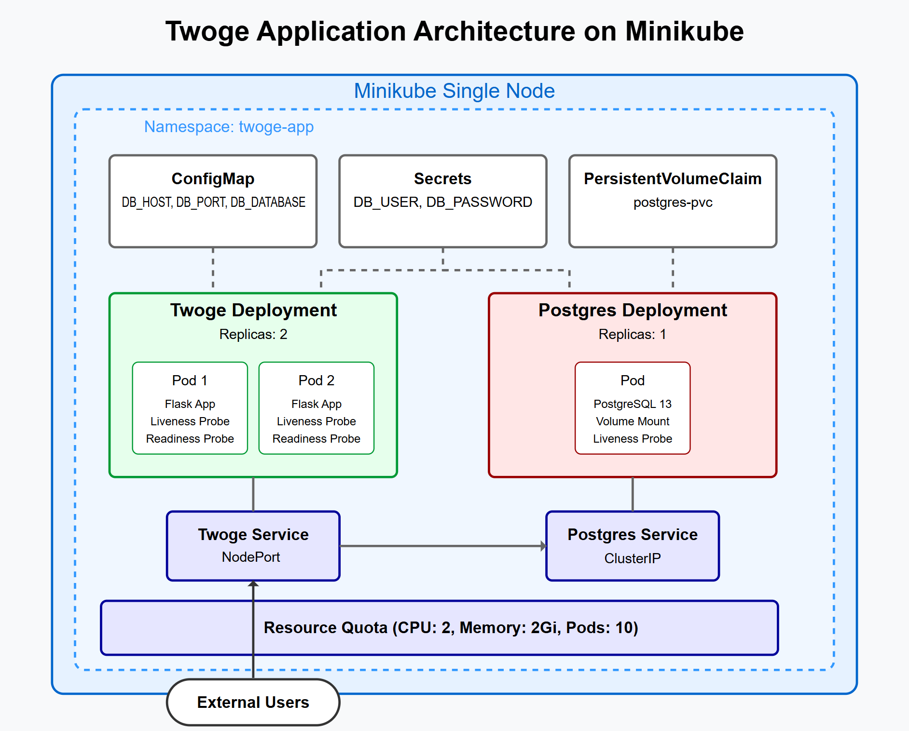
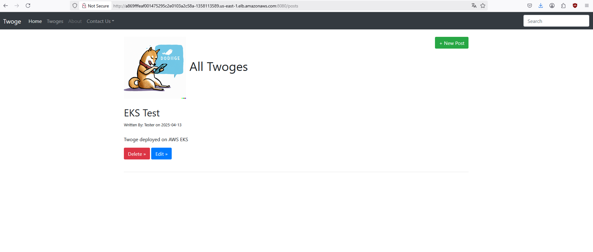

# Twoge Application Kubernetes Deployment

## Assessment Overview
This project demonstrates deploying a Python Flask-based Twitter alternative called 'Twoge' on Kubernetes. The deployment has been tested on both Minikube (locally) and AWS EKS.

## Architecture


The architecture includes:
- **Namespace**: A dedicated `twoge-app` namespace isolating all related resources
- **ConfigMap**: Stores non-sensitive configuration (DB_HOST, DB_PORT, DB_DATABASE)
- **Secrets**: Stores sensitive information (DB_USER, DB_PASSWORD)
- **PersistentVolumeClaim**: Provides persistent storage for the PostgreSQL database
- **Deployments**:
  - Twoge: Flask application with 2 replicas, including liveness and readiness probes
  - PostgreSQL: Database with 1 replica and a liveness probe
- **Services**:
  - Twoge: NodePort/LoadBalancer service for external access
  - PostgreSQL: ClusterIP service for internal database access

## Prerequisites
- Docker installed
- Kubernetes cluster (Minikube for local testing)
- kubectl CLI installed
- AWS CLI configured (for EKS deployment)
- eksctl installed (for EKS deployment)

## Project Structure
```
├── configmap.yaml              # ConfigMap for database configuration
├── Dockerfile                  # Docker image definition for Twoge
├── docker-compose.yml          # Docker Compose for local testing
├── eks-cluster.yaml            # EKS cluster configuration
├── namespace.yaml              # Namespace definition
├── postgres-deployment.yaml    # PostgreSQL database deployment
├── postgres-pvc.yaml           # Persistent Volume Claim for PostgreSQL
├── postgres-service.yaml       # Service for PostgreSQL
├── secrets.yaml                # Secrets for database credentials
├── twoge-deployment.yaml       # Twoge application deployment
└── twoge-service.yaml          # Service for Twoge application
```

## Deployment Steps

### Local Deployment with Minikube

1. Start Minikube
   ```
   minikube start
   ```

2. Create the namespace
   ```
   kubectl apply -f namespace.yaml
   ```

3. Create ConfigMap and Secrets
   ```
   kubectl apply -f configmap.yaml
   kubectl apply -f secrets.yaml
   ```

4. Create PostgreSQL PVC, Deployment, and Service
   ```
   kubectl apply -f postgres-pvc.yaml
   kubectl apply -f postgres-deployment.yaml
   kubectl apply -f postgres-service.yaml
   ```

5. Create Twoge Deployment and Service
   ```
   kubectl apply -f twoge-deployment.yaml
   kubectl apply -f twoge-service.yaml
   ```

6. Verify deployments and services
   ```
   kubectl get pods -n twoge-app
   kubectl get services -n twoge-app
   ```

7. Access the application (using Minikube)
   ```
   minikube service twoge-service -n twoge-app
   ```

### AWS EKS Deployment

1. Create EKS cluster
   ```
   eksctl create cluster -f eks-cluster.yaml
   ```

2. Apply Kubernetes configurations
   ```
   kubectl apply -f namespace.yaml
   kubectl apply -f configmap.yaml
   kubectl apply -f secrets.yaml
   kubectl apply -f postgres-pvc.yaml
   kubectl apply -f postgres-deployment.yaml
   kubectl apply -f postgres-service.yaml
   kubectl apply -f twoge-deployment.yaml
   kubectl apply -f twoge-service.yaml
   ```

3. Get the LoadBalancer URL
   ```
   kubectl get service twoge-service -n twoge-app
   ```

## Implementation Details

### Namespace
Created a dedicated namespace `twoge-app` to isolate all resources related to the application.

### ConfigMap
Stores non-sensitive configuration:
- DB_HOST: "postgres-service"
- DB_PORT: "5432"
- DB_DATABASE: "twoge"

### Secrets
Stores sensitive information like database credentials (base64 encoded):
- DB_USER: "postgres"
- DB_PASSWORD: "postgres"

### Persistent Volume Claim
Provides persistent storage for the PostgreSQL database.

### Probes
- **Liveness Probes**: Ensure containers are running correctly
- **Readiness Probes**: Determine when containers are ready to serve traffic

### Resource Limits
Both deployments include resource requests and limits:
- Twoge: 
  - Requests: 128Mi memory, 100m CPU
  - Limits: 256Mi memory, 200m CPU
- PostgreSQL:
  - Requests: 256Mi memory, 200m CPU
  - Limits: 512Mi memory, 500m CPU

## Screenshots

### Docker Image Screenshot


### Minikube Deployment


### Application Screenshot




### AWS EKS Deployment


## Cleanup

### Minikube
```
kubectl delete namespace twoge-app
```

### AWS EKS
```
kubectl delete namespace twoge-app
eksctl delete cluster -f eks-cluster.yaml
```